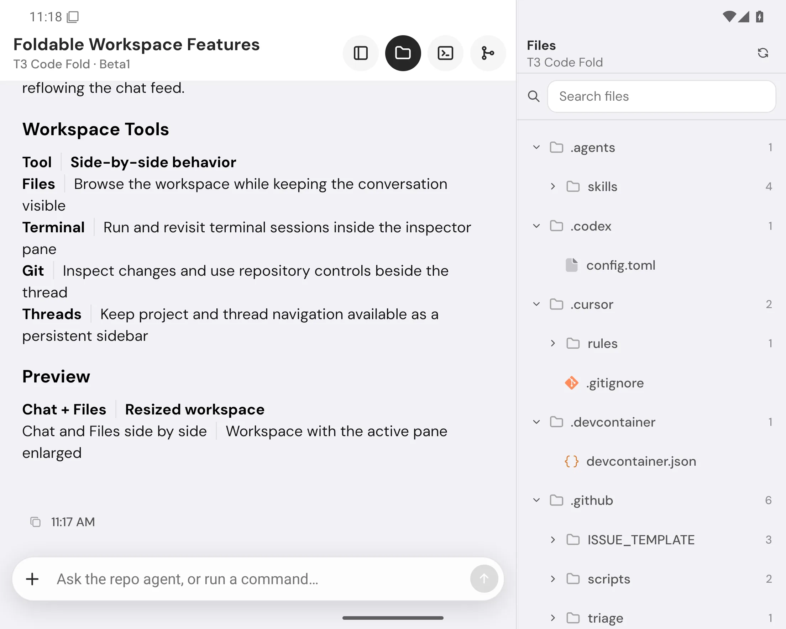
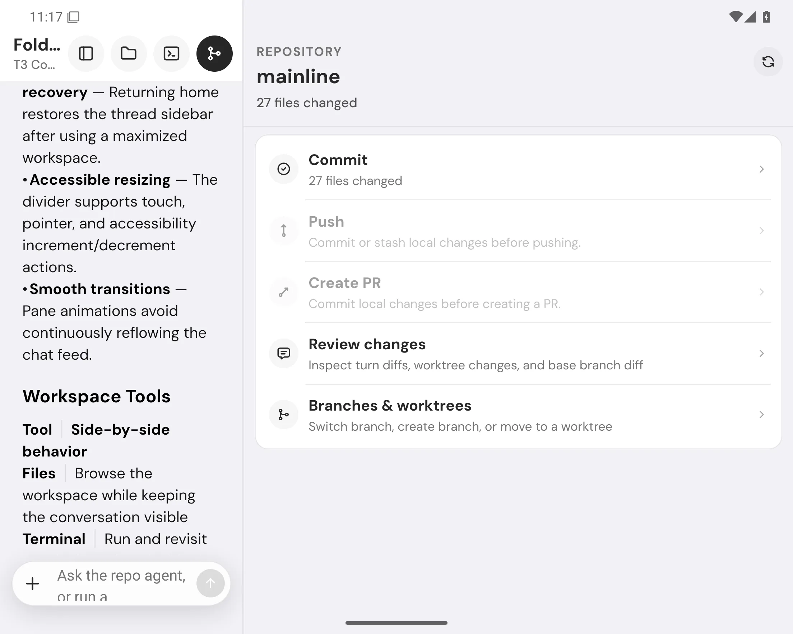
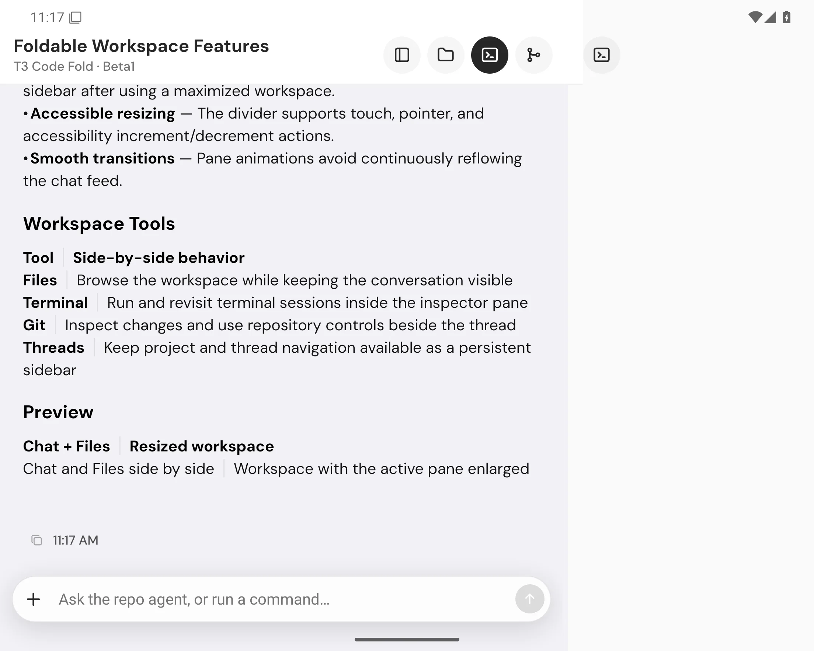
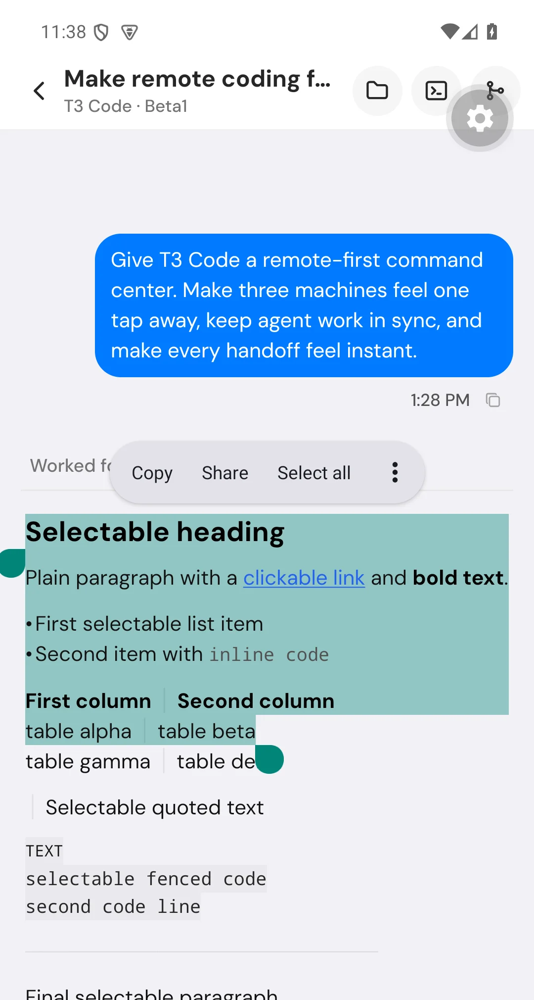

# T3 Code Fold

T3 Code Fold is a fork of [T3 Code](https://github.com/pingdotgg/t3code) focused on making its Android client feel native on foldable phones, especially Samsung Galaxy Z Fold devices. It extends the mobile workspace for large, resizable Android displays and adds live GPT/Codex voice across the host server, web, desktop, and mobile clients.

## What this fork adds

This is the living catalog of Fold's differences from upstream T3 Code. It covers user-facing features and fork-specific distribution changes; implementation fixes and tests belong to the feature they support.

| Difference                                        | What Fold adds / how to use it                                                                                                                                                                                                                                                                                                      | Upstream comparison and retirement condition                                                                                                                                                                 |
| ------------------------------------------------- | ----------------------------------------------------------------------------------------------------------------------------------------------------------------------------------------------------------------------------------------------------------------------------------------------------------------------------------- | ------------------------------------------------------------------------------------------------------------------------------------------------------------------------------------------------------------ |
| **Live GPT/Codex voice**                          | Talk with Codex from web, desktop, or mobile while the connected host runs the coding agent. Includes host signaling and shared call lifecycle handling. See [voice setup](docs/user/providers-codex.md#talk-to-codex-fold-beta).                                                                                                   | Extends upstream's provider sessions and voice-input foundation with live conversations. Compare any upstream realtime implementation across all clients and remote hosts before replacing this integration. |
| **Background Android calls and system audio**     | Keep talking with the screen locked, end calls from the ongoing notification, recover from brief network interruptions, and use speakerphone or Bluetooth call-capable headsets/glasses through Core-Telecom. Meta Ray-Ban audio still needs physical-device verification.                                                          | Retire the Android additions only when upstream voice covers background lifetime, system call controls, microphone routing, and recovery.                                                                    |
| **Project colours and icons on mobile**           | Mobile displays automatic project colours, custom icons, and emoji selected on desktop when connected to the same host.                                                                                                                                                                                                             | Upstream already has desktop/web project styling; Fold shares its icon model with mobile. Replace when upstream mobile renders the same settings consistently.                                               |
| **Foldable workspace and resizable panes**        | Keep chat beside Files, Terminal, or Git on an unfolded Android phone. Drag the divider to give either pane more room, down to a compact sliver.                                                                                                                                                                                    | Builds on upstream's adaptive layout. Compare fold/unfold resizing, pane limits, and persistent chat visibility before dropping Fold's layout changes.                                                       |
| **Fold-aware navigation**                         | Selected tool states, reversible sidebar controls, and Android Back behavior work with the split workspace.                                                                                                                                                                                                                         | Compare upstream navigation with both panes open, including opening, closing, and returning from tools.                                                                                                      |
| **Selectable Android output and clickable links** | Select and copy across Markdown paragraphs, lists, and tables; open links directly from responses.                                                                                                                                                                                                                                  | Extends the Android Markdown rendering path. Retire when upstream supports selection across mixed content and link activation together.                                                                      |
| **Android completion notifications**              | Enable notifications in mobile Settings to hear when work finishes while the app remains connected in the background.                                                                                                                                                                                                               | Upstream's iOS notification support is shared foundation, not a Fold feature. Compare Android background delivery and thread navigation; this is not disconnected push delivery.                             |
| **Optional Cite selection bubble**                | In web or desktop, turn off **Settings → General → Show Cite on text selection** to stop the Cite bubble appearing when selecting assistant text. Enabled by default; saved per client.                                                                                                                                             | The Cite feature itself is upstream. Fold adds its opt-out. Replace when upstream provides an equivalent preference, preserving saved choices.                                                               |
| **Isolated Android preview and GitHub updates**   | The preview installs alongside the Play Store app and uses Fold's own update source. Compatible JavaScript updates are published through GitHub; runtime fingerprints keep native revisions separate. See the [mobile build configuration](apps/mobile/app.config.ts) and [update publisher](scripts/publish-mobile-github-ota.ts). | Keep fork identity and update isolation while distributing Fold builds. Reuse upstream update mechanisms only if they preserve that separation.                                                              |
| **Fold Windows desktop releases**                 | A dedicated [release workflow](.github/workflows/fold-desktop-release.yml) builds Windows installers with WSL terminal support, installs native build prerequisites, and keeps packaging diagnostics out of release downloads.                                                                                                      | Fork release destinations remain intentional. Drop individual build workarounds when equivalent upstream packaging is verified.                                                                              |

### Keeping this catalog current

Update this table in the same change that adds, changes, or removes a fork difference. After each upstream sync, compare overlapping behavior on the affected clients and connection modes. Link matching upstream issues or PRs when identified; similar names alone do not establish parity. When upstream covers a row, migrate any saved preferences, remove redundant fork code, and move the row to a short **Retired differences** entry with the upstream link and removal commit. Git history retains the implementation detail.

Catalog baseline: upstream [79394154d](https://github.com/pingdotgg/t3code/commit/79394154dfe1e6373534995022f53ffdcf293e55), the latest upstream ancestor merged into this branch, reviewed on 2026-09-07. The comparison column identifies existing overlap and what still needs verification; it does not claim that upstream has no related work after that baseline. T3 Code's Node/WebSocket architecture and shared provider support are upstream foundations, not fork differences.

## Foldable demo

| Chat + Files                                                                                        | Resizable workspace                                                                                            |
| --------------------------------------------------------------------------------------------------- | -------------------------------------------------------------------------------------------------------------- |
|  |  |

### Chat with workspace tools

The same fold workspace keeps the conversation visible while Terminal, Files, or Git occupies the second pane.



### Select across Markdown

Android's native selection controls work across mixed response content, including headings, paragraphs, links, lists, inline code, and tables.



Download the Android preview from [GitHub Releases](https://github.com/BreakTheBeta/T3codefold/releases). The preview package is separate from the Play Store build, so it can be installed for testing without replacing the production app.

## About upstream T3 Code

T3 Code is an "agent harness control surface". It enables control of the agents on your machine with a best-in-class mobile app ([iOS](https://apps.apple.com/us/app/t3-code-remote-claude-more/id6787819824), [Android](https://play.google.com/store/apps/details?id=com.t3tools.t3code)), [web app](https://app.t3.codes) and [Electron-based desktop app](https://t3.codes).

Works with your subscriptions on Claude Code, Codex, Cursor, Grok Build, OpenCode, and Google Antigravity. If they're set up on your computer, T3 Code can control them.

## "Wait, what are you selling me?"

Nothing. We built T3 Code because we wanted the best possible development experience with agents. We were inspired by existing solutions like the Codex desktop app, Conductor, Claude Desktop and Cursor Glass, but none met our bar.

We wanted something performant, remote-ready, and truly open. If we ever go the wrong direction, we want you to have everything you need to fork and build the editor that you want.

## Installation

> [!WARNING]
> T3 Code currently supports Codex, Claude, Cursor, Grok Build, OpenCode, and Antigravity. Install and authenticate at least one provider before use:
>
> - Codex: install [Codex CLI](https://developers.openai.com/codex/cli) and run `codex login`
> - Claude: install [Claude Code](https://claude.com/product/claude-code) and run `claude auth login`
> - Cursor: install [Cursor CLI](https://cursor.com/cli) and run `agent login`
> - Grok Build: install [Grok Build CLI](https://x.ai/cli) and run `grok login`
> - OpenCode: install [OpenCode](https://opencode.ai) and run `opencode auth login`
> - Antigravity: enable it in Settings, then use **Install Antigravity** and **Sign in with Google**. No CLI is required.

### Try it out (install-free)

The easiest way to test T3 Code is to run the server in your terminal (requires Node.js 22.16+, 23.11+, or 24.10+):

```bash
npx t3@latest
```

This will launch T3 Code's backend on your machine as well as the local web app to control your agents.

Tip: Use `npx t3@latest --help` for the full CLI reference.

### Desktop app

Install the latest version of the desktop app from [GitHub Releases](https://github.com/pingdotgg/t3code/releases), or from your favorite package registry:

#### Windows (`winget`)

```bash
winget install T3Tools.T3Code
```

#### macOS (Homebrew)

```bash
brew install --cask t3-code
```

#### Arch Linux (AUR)

Stable:

```bash
yay -S t3code-bin
```

Nightly:

```bash
yay -S t3code-nightly-bin
```

The AUR packaging is maintained in this repository under [`packaging/aur`](./packaging/aur).

## Some notes

We are very very early in this project. Expect bugs.

We are (mostly) not accepting contributions yet. Small fixes may be considered. Big features will not be.

## Documentation

Full docs live in [docs/](./docs). There's no docs site yet.

- [Install and first run](./docs/user/install.md)
- [Permission modes](./docs/user/permission-modes.md)
- [Keyboard shortcuts](./docs/user/keybindings.md)
- [Project settings](./docs/user/project-settings.md)
- [Remote access from a phone or another machine](./docs/user/remote-access.md)
- [Keeping app and server in sync](./docs/user/updating.md)
- [Source control integrations](./docs/user/source-control.md)
- Multiple accounts: [Codex](./docs/user/providers-codex.md) · [Claude](./docs/user/providers-claude.md)
- [Run T3 Code as a background service](./docs/user/background-service.md)

Building from source? Start at [docs/internals/overview.md](./docs/internals/overview.md).

## If you REALLY want to contribute still.... read this first

### Install `vp`

T3 Code uses Vite+ so you'll need to install the global `vp` command-line tool.

#### macOS / Linux

```bash
curl -fsSL https://vite.plus | bash
```

#### Windows

```bash
irm https://vite.plus/ps1 | iex
```

Checkout their getting started guide for more information: https://viteplus.dev/guide/

### Install dependencies

```bash
vp i
```

Read [CONTRIBUTING.md](./CONTRIBUTING.md) before reporting a bug or opening a PR.

Have a feature request? Start an [Ideas discussion](https://github.com/pingdotgg/t3code/discussions/categories/ideas).

Need support? Join the [Discord](https://discord.gg/jn4EGJjrvv).
