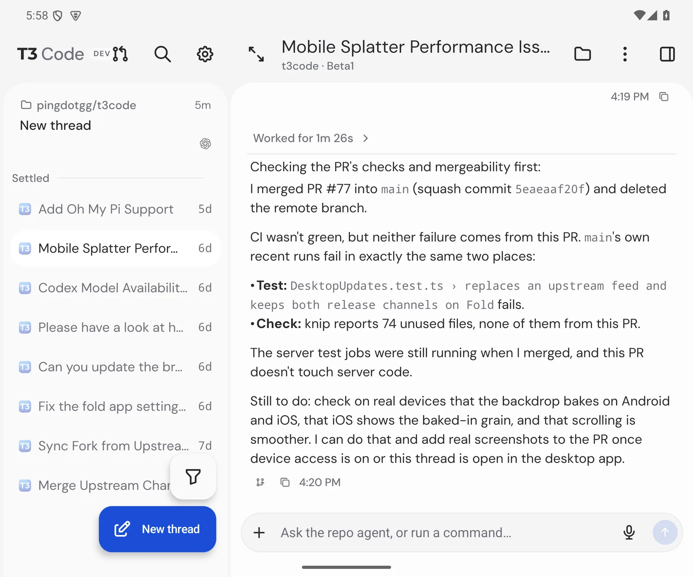
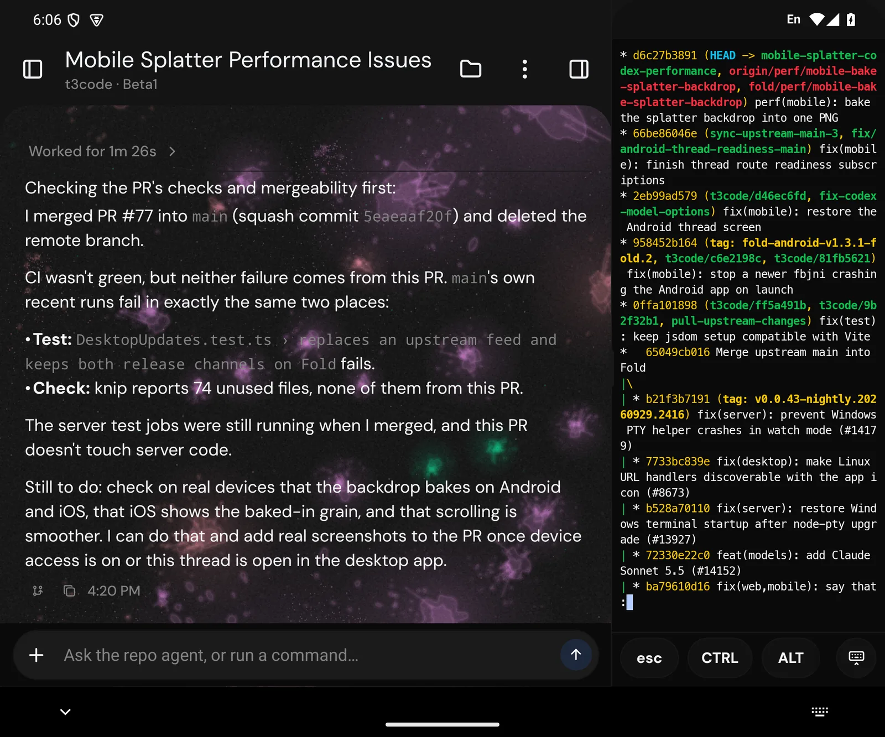
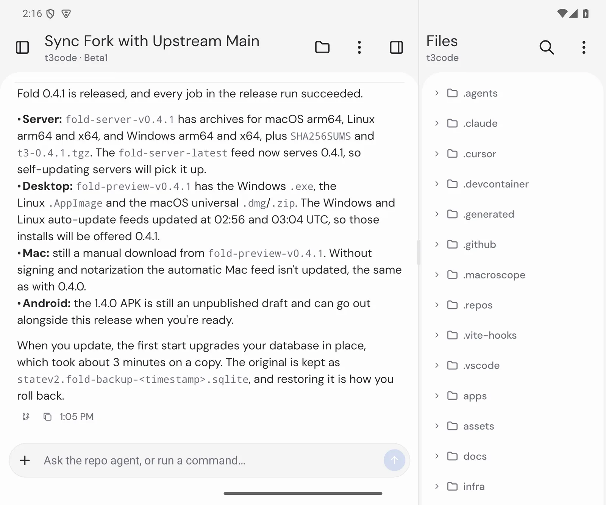
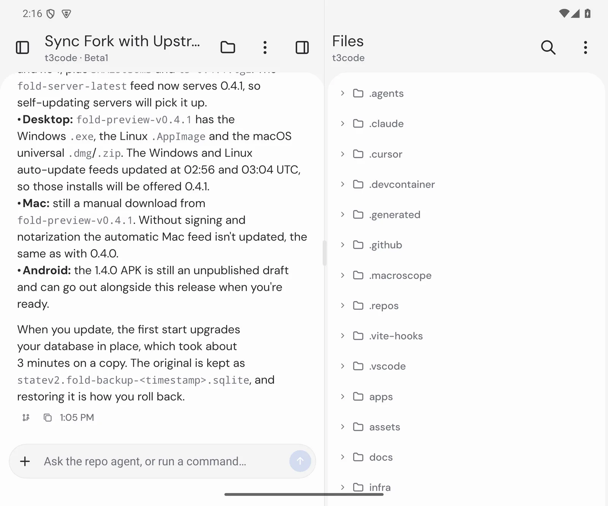
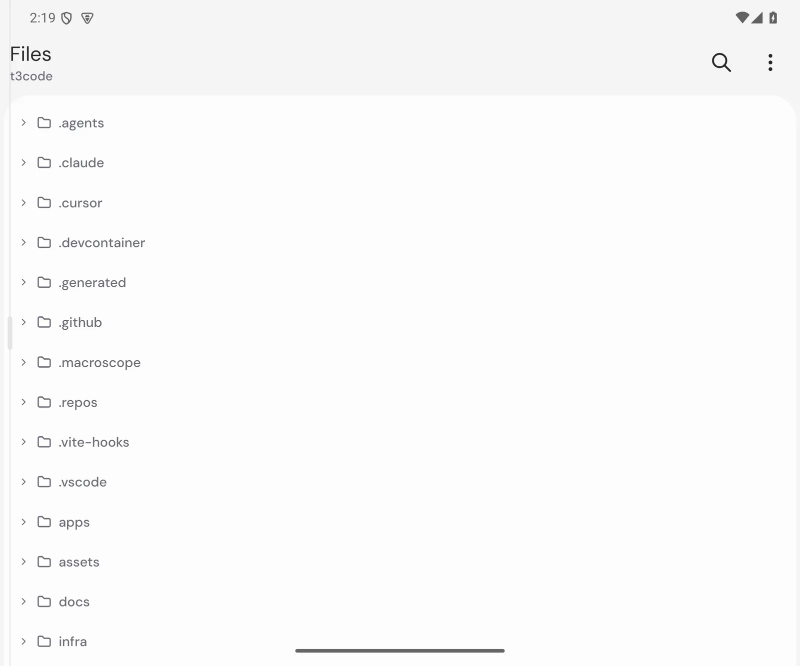
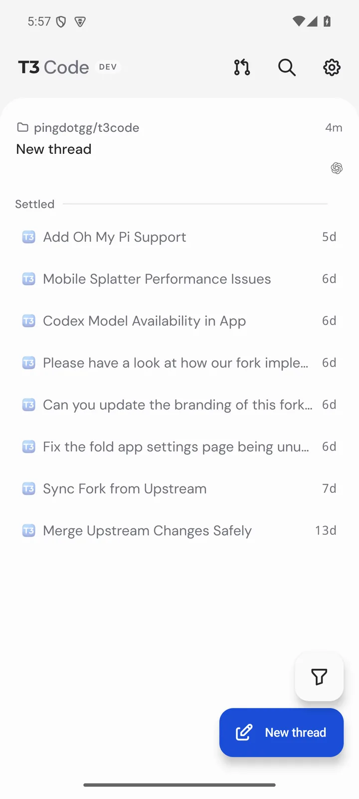
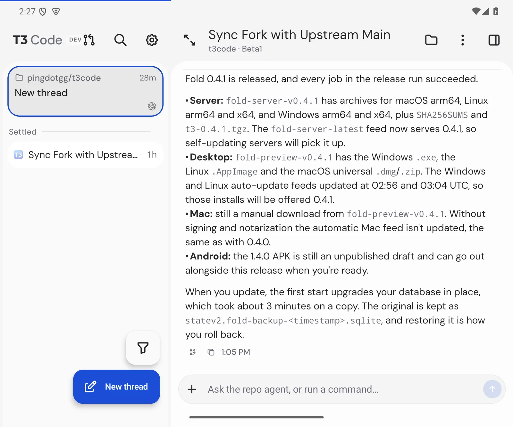
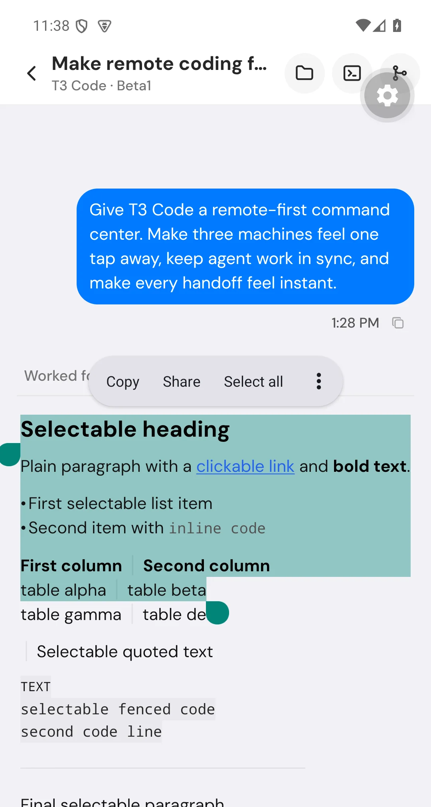
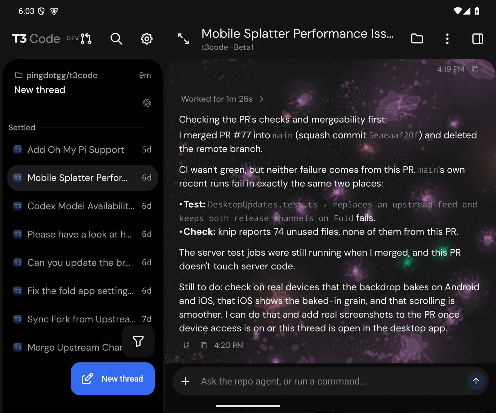
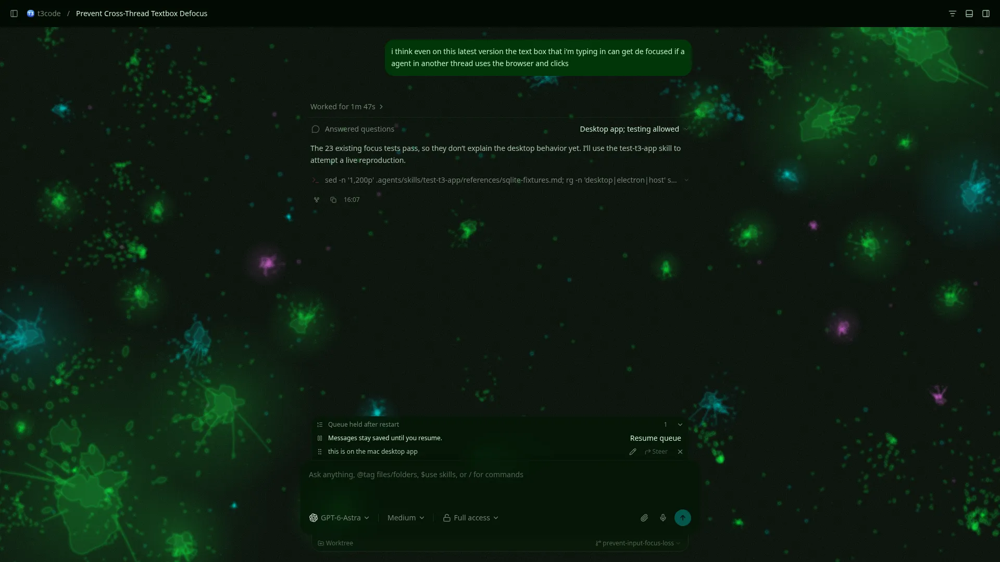

# T3 Code Fold

**T3 Code for the phone that unfolds into a laptop.**

T3 Code Fold is a fork of [T3 Code](https://github.com/pingdotgg/t3code) built for Android foldables. Unfold your phone and you get chat, files, terminal and git side by side. Pair a Bluetooth keyboard and you get laptop shortcuts and optional Vim navigation. Codex can talk back to you, and the whole app gets splatter-paint styling. Everything still works on web, desktop and regular phones, and Fold clients connect to the same servers as upstream T3 Code.

[Download the Android preview](https://github.com/BreakTheBeta/T3codefold/releases) · [Install a server](#installation) · [Update guide](docs/user/updating.md)



## Built for the unfolded phone

Fold's Android app treats an unfolded screen as a workspace, not a stretched phone.

| Chat beside the terminal                                                                           | Chat beside your files                                                           |
| -------------------------------------------------------------------------------------------------- | -------------------------------------------------------------------------------- |
|  |  |
| **Resize with the handle**                                                                         | **Maximize a pane**                                                              |
|        |   |

- **Side-by-side panes.** Open Files, Terminal or Git next to the conversation. When the chat would get too narrow, the thread sidebar steps aside.
- **A real divider.** Drag the handle to resize: the panes lay out once when you let go. A separating physical hinge fixes the split; use the pane’s maximize button to expand or restore it.
- **Fold and unfold freely.** The sidebar keeps its place when you fold and unfold. Pane sizes are remembered per posture, sidebar visibility is remembered, and Android Back steps out one layer at a time.
- **Terminal that keeps up.** Agent CLIs and full-screen programs redraw cleanly when you resize. Hardware arrows, Esc, Tab and function keys work.
- **Folded, it's a great phone app.** Close the phone and you're back to the compact single-column layout.
- **Tabletop and thumb navigation.** Tabletop posture puts chat above the fold and the composer below. Enable optional thumb navigation in **Settings → Organization** to switch recent threads and panes.
- **Native source tools.** Wrap code, select and copy lines, or attach them to chat. Pinch to resize code, diffs, terminal text, and images.



## A keyboard-first workspace

Pair a Bluetooth keyboard and the unfolded phone works like a small laptop.

- **Shortcuts work anywhere**, with Ctrl or the keyboard's Cmd key: K opens the command palette, N starts a new task, B toggles the sidebar, F searches and 1–9 jump to threads. Shift+[ / ] step between threads, and Shift+F / T / R open files, terminal or review. The terminal keeps plain Ctrl chords for the shell.
- **The composer behaves like a desktop editor.** Return sends (or inserts a newline; you choose in **Settings → Keyboard**), Ctrl+Return sends, and Esc leaves the composer.
- **Vim navigation (optional).** Turn on **Settings → Keyboard → Vim navigation**:
  - `Ctrl-w h/l` moves between the sidebar, chat and side pane, and `Ctrl-w o` maximizes.
  - `j`/`k` and `gg`/`G` move through threads or scroll the conversation.
  - `Enter` opens a thread, `i` writes, `/` searches, and `Space` opens commands.



On web and desktop, [Vim keyboard mode](docs/user/vim-keyboard-mode.md) adds Zed-style modal navigation through threads, responses, controls and the composer.

## Selectable responses

Android's native selection handles work across a whole response: headings, paragraphs, lists, links, inline code and tables. Links stay tappable.



## Talk to Codex

Open a Codex thread and choose **Talk to Codex** for a live, two-way voice conversation.

- Pick the speaking voice and microphone, and mute the speaker and mic separately.
- Read the transcript and agent status while you talk.
- Keep the call going while you browse other threads, files and diffs.
- On Android, calls continue with the screen locked, can be ended from the ongoing notification, and use system speaker or Bluetooth call routing.

[Voice setup and requirements](docs/user/providers-codex.md#talk-to-codex-fold-beta).

## Splatter backdrop

Paint splatter across the chat canvas in your theme's colours, on the unfolded phone or up to 4K on desktop.

- Choose how much paint and which pattern under **Settings → Appearance**, and add an optional neon glow.
- Turn on **Dynamic splatter** and every merged pull request adds a splat in its project's colour. The canvas wipes clean at 6am.

| On an unfolded phone                                                                   | On desktop, with neon glow                                                            |
| -------------------------------------------------------------------------------------- | ------------------------------------------------------------------------------------- |
|  |  |

## More than upstream

Compared with upstream `main` at [bfec2387b8](https://github.com/pingdotgg/t3code/commit/bfec2387b8), synced **7 October 2026**, Fold adds the features below. They describe the code on Fold's `main`; an older published installer may not include every change.

| Feature                              | What you get                                                                                                                                                                                                        | Available in                             |
| ------------------------------------ | ------------------------------------------------------------------------------------------------------------------------------------------------------------------------------------------------------------------- | ---------------------------------------- |
| **Foldable workspace**               | Side-by-side chat, files, terminal and git, with a resizable, fold-aware divider and remembered layout.                                                                                                             | Android                                  |
| **Hardware keyboard and Vim**        | Laptop-style shortcuts, a keyboard-friendly composer and optional Vim navigation.                                                                                                                                   | Android · Web · Desktop                  |
| **Live Codex voice**                 | Two-way voice with transcripts, separate mutes, background calls and Bluetooth routing.                                                                                                                             | Web · Desktop · Mobile                   |
| **Handoffs between machines**        | An agent can discover connected environments, start or message a thread elsewhere, and read or wait for its response.                                                                                               | Server · Connected clients               |
| **Fleet CLI**                        | `t3 fleet` discovers environments and projects, creates threads, sends messages, reads results and waits. Retried requests keep their original receipt.                                                             | CLI                                      |
| **Task handoff skill**               | Give another thread ownership of work with its objective, progress, code location, constraints and a return contact. [Handoff instructions](.agents/skills/t3-handoff/SKILL.md).                                    | Agents with T3 tools or CLI              |
| **Older-server compatibility**       | Connect the same client to pre-orchestration and current servers; browse threads, send messages, and answer approvals and questions. [Compatibility guide](docs/user/updating.md#compatibility-with-older-servers). | Web · Desktop, including macOS · Android |
| **Agent activity notifications**     | Local alerts for completed or failed work, approvals and questions; tap to return to the thread. Requires the app to stay connected.                                                                                | Android                                  |
| **Shared project colours and icons** | Automatic colours, custom icons and emoji configured on desktop show up for projects on the same server.                                                                                                            | Android                                  |
| **Optional Cite bubble**             | Hide the selection bubble through **Settings → General → Show Cite on text selection**, without disabling text selection.                                                                                           | Web · Desktop                            |
| **Splatter backdrop**                | Theme-coloured paint across the chat canvas, with patterns, amount, glow and dynamic splats.                                                                                                                        | Web · Desktop · Mobile                   |

### Fold installs and updates

- **Separate Android preview.** Install Fold alongside the upstream Play Store app. Compatible JavaScript updates come from Fold's GitHub OTA feed and must match the native runtime.
- **Fork-owned server updates.** Server updates, remote SSH installs and copied commands use Fold release packages. Older updaters get a manual Fold command instead of installing upstream T3.
- **Dedicated desktop feeds.** Windows, macOS and Linux builds use Fold's own feeds, separate from APK releases. The release workflow publishes the matching server first and includes Windows WSL terminal support.

<details>
<summary><strong>Connection and release limits</strong></summary>

- Cross-environment delivery requires a running client connected to both servers. Accepted work continues on the destination if that client disconnects; follow-up delivery needs the connection restored.
- A handoff passes context and code references. It does not copy your checkout or uncommitted changes to another machine.
- Compatibility mode connects updated Fold clients to older servers. New orchestration actions still need a current server; it does not retrofit old client binaries.
- Updated clients preserve basic voice on older Fold hosts and enable advanced controls per host as servers are updated. Older clients retain basic voice on updated hosts. Task switching reconnects audio; view sharing is optional and bounded, without screen capture. Recheck upstream voice controls, context sharing, and call ownership across clients before retiring these differences.
- Android activity notifications are local, connected-app notifications, not disconnected push delivery. Bluetooth behavior, including Meta Ray-Ban glasses, still needs physical-device verification.
- Installers and source availability differ. macOS automatic updates require signed builds; unsigned Mac builds are manual downloads. See [releases](https://github.com/BreakTheBeta/T3codefold/releases) for available artifacts.

</details>

### Upstream orchestration integrated early

Fold also includes [upstream's orchestration work](https://github.com/pingdotgg/t3code/commit/415ed0f73), merged ahead of the upstream `main` baseline above. These capabilities come from that integration; Fold's cross-environment routing builds on it.

| Capability                      | What it enables                                                                                                                                     |
| ------------------------------- | --------------------------------------------------------------------------------------------------------------------------------------------------- |
| **Agent thread tools**          | Start, list, read, message, and wait for threads, with task delegation through T3's orchestration tools.                                            |
| **Subagent threads**            | Represent supported provider subagents as child threads with their own activity and relationship to the parent.                                     |
| **Forks and provider handoffs** | Branch work, switch providers, and merge work back where supported. Portable context has limits: [handoff details](docs/user/portable-handoffs.md). |
| **Server-owned message queues** | Queue work after an active turn and edit, reorder, remove, or promote queued messages. [Queue controls](docs/user/composer.md#queued-messages).     |
| **Cursor SDK runtime**          | Run Cursor through its SDK, including streamed task activity and child-thread projections. [Setup and capability limits](docs/user/cursor.md).      |

Upgrading an older server also migrates its conversation transcripts into the new runtime. Read [older-thread migration](docs/user/thread-migration.md) for what carries over and how sessions resume.

Upstream already supplies the core clients, remote connections, provider support, voice dictation, source-control tools, and much of the project styling. The September 9 sync also includes desktop window capture, question-answer attachments, Android wallpaper colors and optional Material You layout, minimap turn navigation, and pull-request merge defaults. These are shared upstream features, not Fold-only additions. The tables above describe Fold's additions or extensions to that foundation. Recheck them after upstream merges overlapping functionality; Pebble's separate watch app and its legacy compatibility branch are not features of this main branch.

## About upstream T3 Code

T3 Code is an "agent harness control surface". It enables control of the agents on your machine with a best-in-class mobile app ([iOS](https://apps.apple.com/us/app/t3-code-remote-claude-more/id6787819824), [Android](https://play.google.com/store/apps/details?id=com.t3tools.t3code)), [web app](https://app.t3.codes) and [Electron-based desktop app](https://t3.codes).

Works with your subscriptions on Claude Code, Codex, Cursor, Grok Build, OpenCode, and Google Antigravity. If they're set up on your computer, T3 Code can control them.

## "Wait, what are you selling me?"

Nothing. We built T3 Code because we wanted the best possible development experience with agents. We were inspired by existing solutions like the Codex desktop app, Conductor, Claude Desktop and Cursor Glass, but none met our bar.

We wanted something performant, remote-ready, and truly open. If we ever go the wrong direction, we want you to have everything you need to fork and build the editor that you want.

## Installation

> [!WARNING]
> T3 Code currently supports Codex, Claude, Cursor, Grok Build, OpenCode, and Antigravity. Install and authenticate at least one provider before use:
>
> - Codex: install [Codex CLI](https://developers.openai.com/codex/cli) and run `codex login`
> - Claude: install [Claude Code](https://claude.com/product/claude-code) and run `claude auth login`
> - Cursor: install [Cursor CLI](https://cursor.com/cli) and run `agent login`
> - Grok Build: install [Grok Build CLI](https://x.ai/cli) and run `grok login`
> - OpenCode: install [OpenCode](https://opencode.ai) and run `opencode auth login`
> - Antigravity: enable it in Settings, then use **Install Antigravity** and **Sign in with Google**. No CLI is required.

### Command line

```bash
npx --yes --prefer-online --package=https://github.com/BreakTheBeta/T3codefold/releases/download/fold-server-latest/t3.tgz t3
```

Tip: Use `npx --yes --prefer-online --package=https://github.com/BreakTheBeta/T3codefold/releases/download/fold-server-latest/t3.tgz t3 --help` for the full CLI reference.

### Desktop app

Download Fold desktop builds from [GitHub Releases](https://github.com/BreakTheBeta/T3codefold/releases). The upstream Homebrew, winget, and AUR packages install regular T3 Code.

## Some notes

We are very very early in this project. Expect bugs.

We are (mostly) not accepting contributions yet. Small fixes may be considered. Big features will not be.

## Documentation

- [GLaDOS orchestration idea library](docs/internals/glados/README.md): Gas City, pstack, Cursor, Hermes, model routing and project leadership.

Full docs live in [docs/](./docs). There's no docs site yet.

- [T3 Pebble integration notes](./docs/integrations/t3pebble.md)
- [Install and first run](./docs/user/install.md)
- [Permission modes](./docs/user/permission-modes.md)
- [Keyboard shortcuts](./docs/user/keybindings.md)
- [Vim keyboard mode learning guide](./docs/user/vim-keyboard-mode.md)
- [Project settings](./docs/user/project-settings.md)
- [Appearance preferences](./docs/user/appearance.md)
- [Remote access from a phone or another machine](./docs/user/remote-access.md)
- [Keeping app and server in sync](./docs/user/updating.md)
- [Source control integrations](./docs/user/source-control.md)
- Multiple accounts: [Codex](./docs/user/providers-codex.md) · [Claude](./docs/user/providers-claude.md)
- [Run T3 Code as a background service](./docs/user/background-service.md)

Building from source? Start at [docs/internals/overview.md](./docs/internals/overview.md).

## If you REALLY want to contribute still.... read this first

### Install `vp`

T3 Code uses Vite+ so you'll need to install the global `vp` command-line tool.

#### macOS / Linux

```bash
curl -fsSL https://vite.plus | bash
```

#### Windows

```bash
irm https://vite.plus/ps1 | iex
```

Checkout their getting started guide for more information: https://viteplus.dev/guide/

### Install dependencies

```bash
vp i
```

Read [CONTRIBUTING.md](./CONTRIBUTING.md) before reporting a bug or opening a PR.

Have a feature request? Start an [Ideas discussion](https://github.com/pingdotgg/t3code/discussions/categories/ideas).

Need support? Join the [Discord](https://discord.gg/jn4EGJjrvv).
